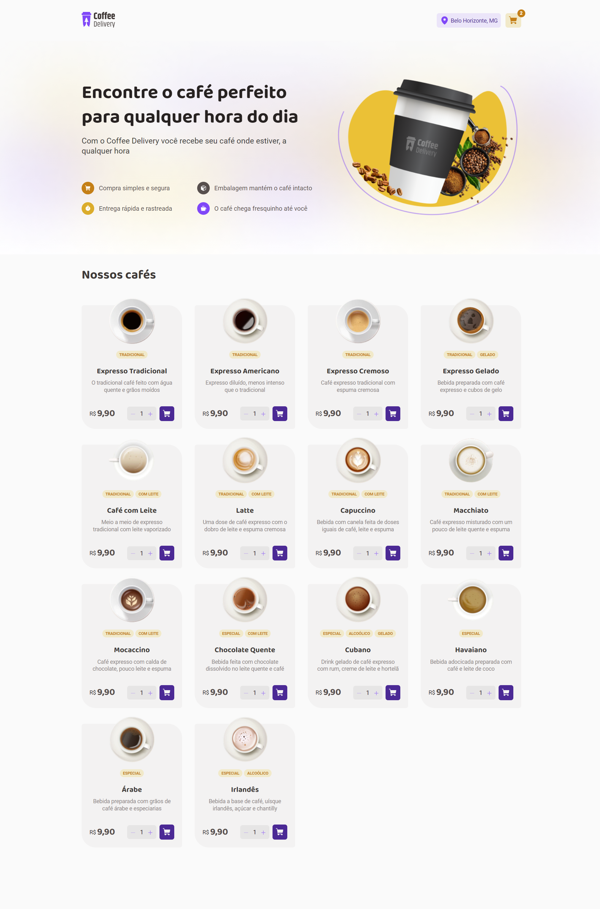
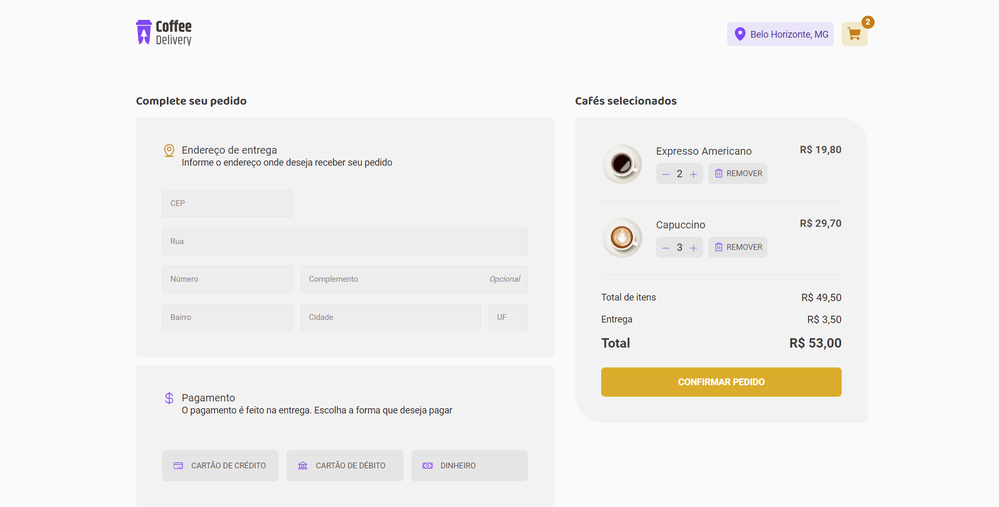
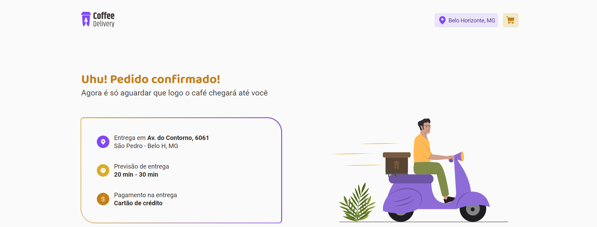

# Coffee Delivery

## Descrição

O Coffee Delivery é uma aplicação web desenvolvida em React que simula o carrinho de compras de uma cafeteria, permitindo aos usuários escolherem e adicionarem diferentes tipos de cafés ao carrinho. A aplicação oferece uma interface intuitiva para o usuário gerenciar seus pedidos e finalizar a compra.







## Tecnologias

* **React:** Biblioteca JavaScript para construção de interfaces de usuário.
* **React Router Dom:** Biblioteca para gerenciamento de rotas e navegação entre páginas.   
* **Styled Components:** Biblioteca CSS-in-JS para estilização dos componentes.
* **Zod:** Biblioteca de validação de dados.
* **React Hook Form:** Biblioteca para criação de formulários.
* **Immer:** Biblioteca para imutabilidade de dados.
* **@hookform/resolvers:** Resolvers para o React Hook Form.
* **Inner:** Biblioteca para manipulação de objetos.
* **Polished:** Biblioteca de utilitários CSS.
* **LocalStorage:** Armazenamento de dados localmente no navegador.

## Como executar o projeto

1. **Clone o repositório:**
  ```bash
  git clone https://github.com/faelperini/02-coffee-delivery
  ```

2. **Instale as dependências:**
  ```bash
  cd 02-coffee-delivery
  npm install
  ```

3. **Inicie o desenvolvimento:**
  ```Bash
  npm run dev
  ```

O aplicativo será iniciado em http://localhost:5173/

## Funcionalidades

**Catálogo de Produtos:** Apresenta uma lista completa dos cafés disponíveis, com seus respectivos preços.

**Carrinho de Compras:** Permite aos usuários adicionarem, removerem e ajustarem a quantidade de itens no carrinho.

**Formulário de Endereço:** Coleta as informações de endereço do usuário para a finalização da compra (implementação simulada neste projeto).

**Resumo do Pedido:** Exibe o total de itens e o valor total da compra.

## Conceitos Abordados

* **Estados:** Gerenciamento do estado da aplicação utilizando o React Context API.
* **Context API:** Compartilhamento de dados entre componentes.
* **LocalStorage:** Persistência de dados localmente para manter o estado do carrinho mesmo após atualizações de página.
* **Imutabilidade:** Garantia da integridade dos dados através da utilização da biblioteca Immer.
* **Listas e Chaves:** Renderização de listas de itens utilizando chaves únicas para otimização.
* **Propriedades:** Passagem de dados entre componentes através de propriedades.
* **Componentização:** Divisão da interface em componentes reutilizáveis para melhor organização e manutenção.
